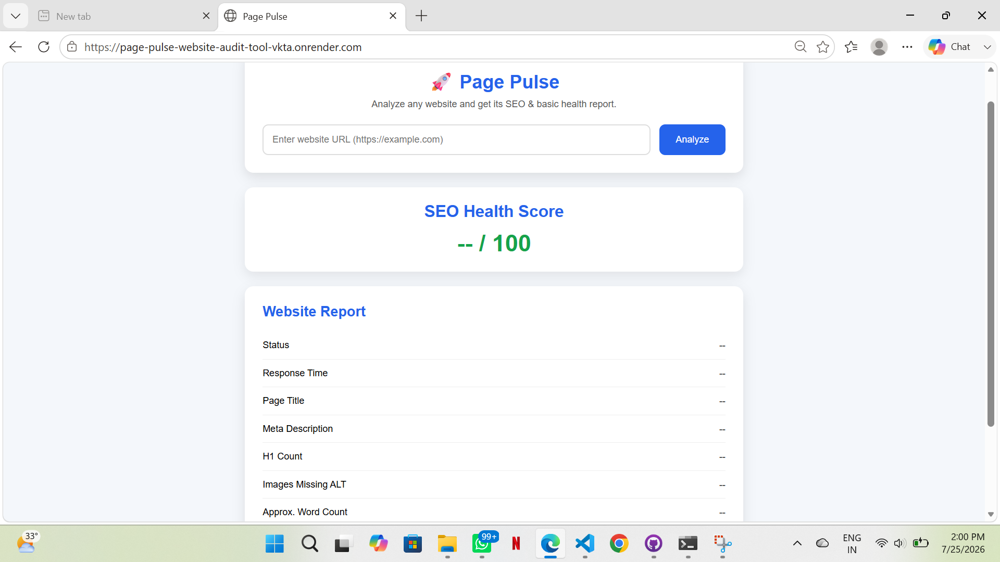
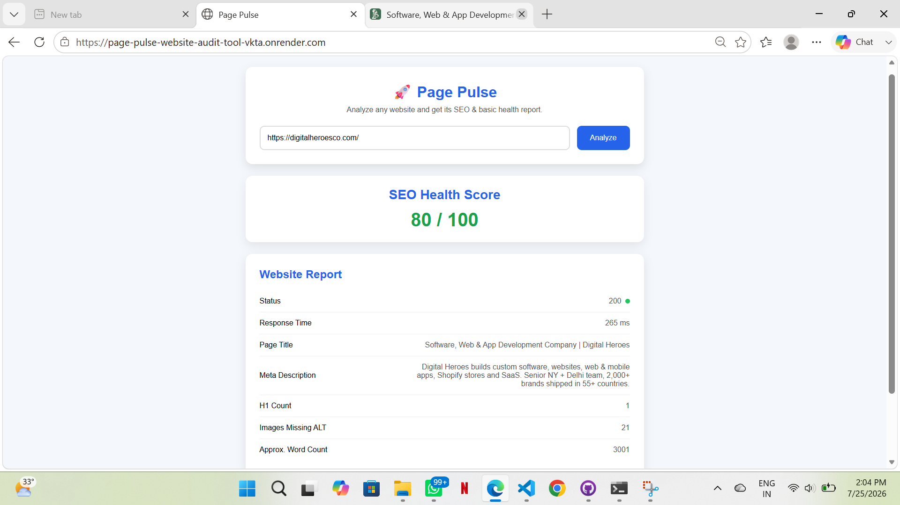
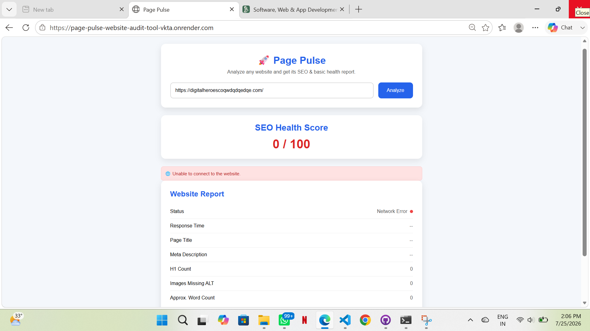

# 🚀 Page Pulse – Website Audit Tool

A lightweight web application built with **Flask**, **Python**, and **BeautifulSoup** that analyzes any website and provides a basic SEO & website health report.

This project was developed as part of a **Software Development Engineering Internship Assignment** to demonstrate backend development, web scraping, API integration, and frontend-backend communication.

---

## 🌐 Live Project

https://page-pulse-website-audit-tool-vkta.onrender.com/

---

## 📌 Features

✅ Analyze any website by entering its URL

✅ Check Website Status Code

✅ Measure Response Time

✅ Extract Page Title

✅ Extract Meta Description

✅ Count H1 Tags

✅ Count Images Missing ALT Attributes

✅ Calculate Approximate Word Count

✅ Responsive User Interface

✅ Flask REST API

✅ BeautifulSoup HTML Parsing

✅ Automated unit tests for analyzer functionality
---

## 📸 Preview

### Homepage

- Simple and clean user interface
- Enter any website URL
- Click **Analyze**

### Website Report

The application displays:

- HTTP Status Code
- Response Time
- Page Title
- Meta Description
- H1 Tag Count
- Images Missing ALT Attributes
- Approximate Word Count

---

# 🛠️ Tech Stack

## Frontend

- HTML5
- CSS3
- JavaScript

## Backend

- Python
- Flask

## Libraries

- Requests
- BeautifulSoup4

---

# 📂 Project Structure

```
Page-Pulse-Website-Audit-Tool/
│
├── app.py
├── analyzer.py
├── requirements.txt
├── README.md
│
├── templates/
│   └── index.html
│
├── static/
│   ├── style.css
│   └── script.js
│
└── tests/
│   └── test_analyzer.py
│
├── screenshots/
│   ├── homepage.png
│   ├── invalid-url-error.png
│   └── results.png
```

---

## 📸 Screenshots

### Home Page


### Audit Result


### Invalid URL Error


---

# 🏗️ Design Decisions

The project follows a simple modular architecture to keep the code easy to understand, maintain, and extend.

## Backend

- Flask is used to expose a lightweight REST API.
- Business logic is separated into `analyzer.py`.
- `app.py` is responsible only for routing and request handling.

## Frontend

- HTML provides the page structure.
- CSS is used for styling and responsive layout.
- JavaScript communicates with the backend using the Fetch API and updates the UI dynamically.

## Website Analysis

The analyzer extracts the following information:

- HTTP Status Code
- Response Time
- Page Title
- Meta Description
- Number of H1 Tags
- Images Missing ALT Attributes
- Approximate Word Count

## Error Handling

The application handles common scenarios such as:

- Invalid URLs
- Network connection failures
- Request timeouts
- Websites that restrict automated requests

Instead of crashing, the backend returns a structured JSON response so the frontend can display meaningful information to the user.

## Why This Architecture?

Separating the analysis logic (`analyzer.py`) from the Flask routes (`app.py`) keeps the project modular and makes it easier to test, debug, and extend with additional SEO checks in the future.

---

# ⚙️ Setup

## Prerequisites

- Python 3.10 or higher
- pip

---

## Installation

### 1. Clone the repository

```bash
git clone https://github.com/yourusername/Page-Pulse-Website-Audit-Tool.git
```

### 2. Navigate to the project

```bash
cd Page-Pulse-Website-Audit-Tool
```

### 3. (Optional) Create a virtual environment

Windows

```bash
python -m venv venv
venv\Scripts\activate
```

macOS/Linux

```bash
python3 -m venv venv
source venv/bin/activate
```

### 4. Install dependencies

```bash
pip install -r requirements.txt
```

### 5. Run the application

```bash
python app.py
```

### 6. Open in your browser

```
http://127.0.0.1:5000
```
---

# 📖 How It Works

1. User enters a website URL.
2. JavaScript sends the URL to the Flask backend.
3. Flask receives the request through the `/analyze` API.
4. The backend fetches the webpage using the Requests library.
5. BeautifulSoup parses the HTML content.
6. Important SEO information is extracted.
7. The analysis is returned as JSON.
8. JavaScript updates the UI with the website report.

---
# 🔌 API Contract

The application exposes a single REST API endpoint for website analysis.

## Endpoint

POST /analyze

---

## Request Headers

Content-Type: application/json

---

## Request Body

```json
{
  "url": "https://example.com"
}
```

The application also accepts URLs without a protocol (e.g., `example.com`) and automatically prefixes them with `https://`.

---

## Success Response (HTTP 200)

```json
{
  "status": 200,
  "response_time": "235 ms",
  "title": "Example Domain",
  "meta": "Not Found",
  "h1_count": 1,
  "missing_alt": 0,
  "word_count": 21
}
```

---

## Error Response

```json
{
  "status": "Error",
  "response_time": "--",
  "title": "Unable to Analyze",
  "meta": "--",
  "h1_count": 0,
  "missing_alt": 0,
  "word_count": 0,
  "error": "Description of the error"
}
```

---

## Supported Input

- https://example.com
- http://example.com
- example.com

---

# 📊 Example Output

| Metric | Example |
|---------|---------|
| Status | 200 |
| Response Time | 235 ms |
| Page Title | Example Domain |
| Meta Description | Not Found |
| H1 Count | 1 |
| Missing ALT Images | 0 |
| Word Count | 21 |

---

## Automated Tests

This project includes automated tests to verify the core functionality of the website analyzer.

### Test Cases

- ✅ Happy Path – Verifies that a valid website (e.g., https://example.com) returns a successful response and expected analysis data.
- ✅ URL Without Protocol – Ensures URLs entered without `http://` or `https://` are automatically handled.
- ✅ Invalid URL – Checks that invalid or unreachable URLs are handled gracefully without crashing the application.
- ✅ Request Timeout – Simulates a network timeout and verifies that the application returns an appropriate timeout response.

### Run Tests

```bash
python -m unittest tests/test_analyzer.py
```

Or, to run all tests:

```bash
python -m unittest discover tests
```

---

# 💡 Current Capabilities

✔ Website Reachability Check

✔ HTML Parsing

✔ SEO Information Extraction

✔ Response Time Calculation

✔ REST API Integration

✔ Responsive Frontend

---

# 🚧 Future Improvements

- SEO Health Score
- Download Report as PDF
- Export Report as JSON
- Dark Mode
- Loading Animation
- Keyword Density Analysis
- Broken Link Detection
- Open Graph Tag Detection
- Mobile Friendliness Check
- Lighthouse API Integration

---

# 🧪 Testing

The application has been tested with websites such as:

- https://example.com
- https://python.org
- https://flask.palletsprojects.com

Some websites (such as Amazon and Wikipedia) may return HTTP 403 or 503 responses due to anti-bot protection, which is expected behavior when using standard HTTP requests.

---

# 📦 Dependencies

```
Flask
requests
beautifulsoup4
```

---

# 👨‍💻 Author

**Naina Kharayat**

Developed as part of a **Software Development Engineering Internship Assignment** using Flask, Python, Requests, BeautifulSoup, HTML, CSS, and JavaScript.

---

# 📄 License

This project is developed for educational and internship assessment purposes.

---

# 🤖 AI Usage

AI tools were used to assist with brainstorming, debugging, improving code structure, and refining documentation. All implementation, testing, customization, and final technical decisions were reviewed, verified, and completed by the project author.
